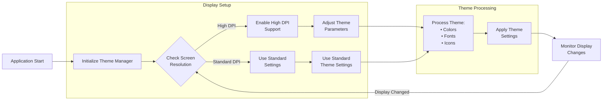

### PyQt automatic DPI scaling factor

Q:
I am developing a Python PyQt application and trying to implement a theme manager that is cross platform but I am finding the theme manager does not work well on high-res video systems.  about half the the themes are virtually unuseable due to high contrast and bizzar color combination while the same theme manager works just fine on medium and low res systems.  What suggestions do you have.

A:
To effectively handle high-resolution display issues in your PyQt theme manager, we'll need to implement several key strategies that work across different platforms and screen densities. Let's break down the solution into manageable parts.

###  Understanding Display Scaling

High-resolution displays present unique challenges because they pack more pixels into the same physical space. This means UI elements can appear either too small or incorrectly scaled unless properly handled. The core issue isn't actually with the themes themselves, but rather how they're rendered on high-DPI displays.



The diagram above illustrates the complete lifecycle of our theme management system. When your application starts, it initializes the theme manager and checks the display configuration. On high-DPI screens (typically 144dpi or higher), we enable proper scaling support and adjust theme parameters accordingly. Even after initial setup, the system continues to monitor for display changes (like moving windows between monitors of different resolutions), ensuring consistent appearance across all scenarios.

###  Core Implementation

Let's implement this solution with proper display scaling support:

```python
from PyQt5.QtCore import Qt
from PyQt5.QtGui import QFontDatabase, QIcon
from PyQt5.QtWidgets import QApplication, QMainWindow

class ThemeManager:
    def __init__(self):
        self.app = QApplication.instance()
        self.setup_display_scaling()
        
    def setup_display_scaling(self):
        """Initialize display scaling support"""
        self.app.setAttribute(Qt.AA_EnableHighDpiScaling)
        self.app.setAttribute(Qt.AA_UseHighDpiPixmaps)
        
    def adjust_for_high_dpi(self, widget):
        """Adjust widget properties for high DPI displays"""
        screen = widget.screen()
        dpi_ratio = screen.logicalDotsPerInch() / 96.0
        
        # Scale fonts appropriately
        font = widget.font()
        font.setPointSize(font.pointSize() * dpi_ratio)
        widget.setFont(font)
        
        # Scale icon sizes
        base_icon_size = int(16 * dpi_ratio)
        widget.setIconSize(QSize(base_icon_size, base_icon_size))
```

###  Theme-Specific Adjustments

To handle the contrast and color issues you're experiencing, implement these theme-specific optimizations:

```python
class Theme:
    def __init__(self, name, base_colors):
        self.name = name
        self.colors = self._adjust_colors(base_colors)
        
    def _adjust_colors(self, base_colors):
        """Adjust colors for better visibility on high-res displays"""
        adjusted = {}
        for key, color in base_colors.items():
            # Convert QColor to RGB
            rgb = color.getRgb()
            
            # Reduce contrast for high-DPI displays
            if QApplication.primaryScreen().physicalDotsPerInch() > 144:
                r = self._limit_contrast(rgb[0])
                g = self._limit_contrast(rgb[1])
                b = self._limit_contrast(rgb[2])
                adjusted[key] = QColor(r, g, b)
            else:
                adjusted[key] = color
        return adjusted
    
    @staticmethod
    def _limit_contrast(color_value):
        """Reduce extreme color values to improve readability"""
        if color_value < 50:
            return max(25, color_value + 25)
        elif color_value > 205:
            return min(235, color_value - 25)
        return color_value
```

###  Best Practices for Implementation

1. **Theme Loading**  - Load themes after initializing display scaling
  - Apply DPI adjustments before showing widgets
  - Cache scaled resources to improve performance


2. **Widget Creation**```python
def create_scaled_widget(parent, widget_class, **kwargs):
    widget = widget_class(parent)
    theme_manager.adjust_for_high_dpi(widget)
    return widget
```


3. **Icon Handling**  - Provide multiple icon sizes for different DPI levels
  - Use SVG icons where possible for better scaling
  - Implement fallback bitmaps for complex graphics


###  Testing Recommendations

To ensure your theme manager works across different setups:

1. Test on various display configurations:
          - Standard monitors (96 DPI)
  - High-resolution laptops (144+ DPI)
  - Mixed-display setups
  - Different operating systems


2. Monitor these key metrics:
          - UI element visibility
  - Color contrast ratios
  - Font readability
  - Icon clarity


###  Additional Considerations

1. **Fallback Themes**  - Implement a fallback theme for problematic configurations
  - Allow users to override automatic scaling
  - Provide theme customization options


2. **Performance**  - Cache scaled resources
  - Use lazy loading for theme assets
  - Implement proper resource cleanup


3. **Cross-Platform Compatibility**  - Test on Windows, macOS, and Linux
  - Handle platform-specific scaling behaviors
  - Implement graceful degradation for unsupported features


By implementing these strategies, you should see significant improvements in how your themes render across different display configurations. The key is to handle scaling dynamically while maintaining consistent appearance and usability.