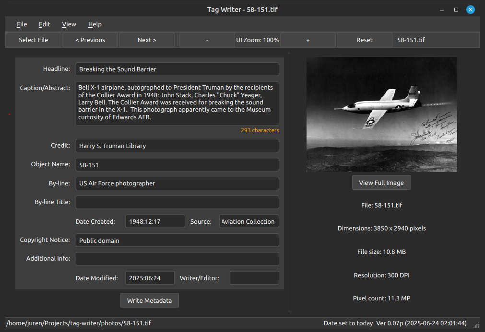

# tag-writer

Tag Writer is a free, open-source application designed to view and edit IPTC metadata in image files (JPG and TIF formats). This tool is particularly useful when metadata cannot be pulled from an online database and needs to be entered manually.

The application provides a simple graphical user interface for editing common IPTC metadata fields, allowing photographers, archivists, and digital asset managers to properly tag their images with essential information.



tag-writer has been tested against the following file types:

- JPEG / JPG
- TIFF / TIF
- PNG

 IPTC tag set
 ```
           IPTC Tag Names                   HSTL PDB Labels
     - Headline                        : {title} e.g. 2018 Harry's Hop n' Hunt
     - Caption-Abstract                : {description} e.g. Easter Egg Roll at the 2018 Harry's Hop'n Hunt.<br>
     - Object Name                     : {Accession No} e.g. 2010-365
     - Writer-Editor                   : {archivist/editor} e.g. LAA
     - By-line                         : {photographer}
     - By-line Title                   : {Institutional Creator}
     - Credit                          : {Credit} Harry S. Truman Library
     - Source                          : {collection} e.g. RG 64
     - Copyright Notice                : {Restrictions} Public Domain - This item is in the public domain and can be used freely without further permission.
```

